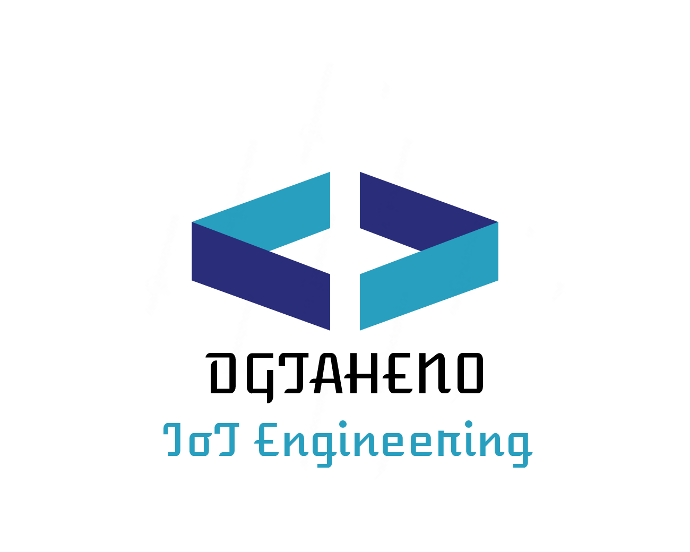

<p align="center">
  
</p>

<h1 align="center">David García-Taheño</h1>

<p align="center">
  <strong>Embedded Software Engineer</strong>
</p>

<p align="center">
  Industrial Engineering • IoT • Telemetry • Real Hardware
</p>

---

## About Me

Industrial Engineering and Technical Sales professional with more than 16 years of experience in international engineering projects.

Currently building an Embedded Systems and IoT portfolio focused on:

- ESP32 Development
- Embedded C++
- Flight Telemetry
- GNSS / GPS Systems
- Sensor Integration
- Data Logging
- Real Hardware Design

My objective is to combine industrial engineering experience with practical embedded software development.

---

## Featured Projects

### 🚀 Flight Telemetry & Data Logger

ESP32 based flight computer featuring:

- BMP388 telemetry
- GPS navigation
- Flight altitude calculation
- Timestamped SD logging
- Power-On Self Test (POST)
- Modular firmware architecture

### 📬 iMail

ESP32-CAM smart mailbox notification system.

Features:

- Telegram notifications
- Image capture
- Remote monitoring
- Home IoT integration

### 🖨️ Marlin Firmware Projects

Custom firmware configuration and development for 3D printers.

---

## Technical Skills

### Embedded

```text
ESP32
C
C++
PlatformIO
I2C
SPI
UART
GNSS
Sensors
